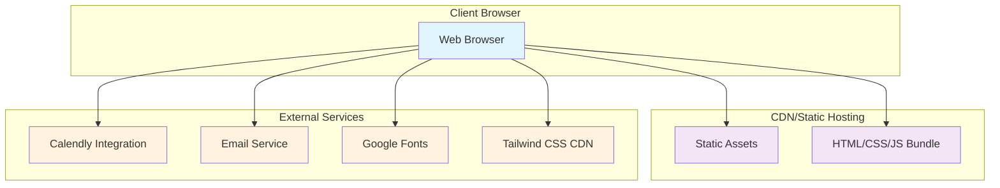
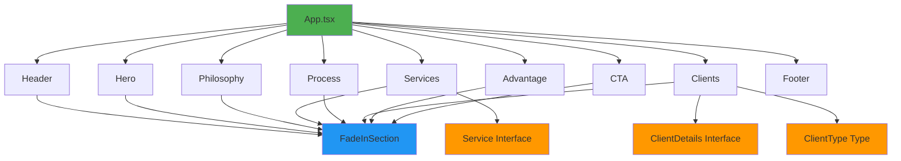
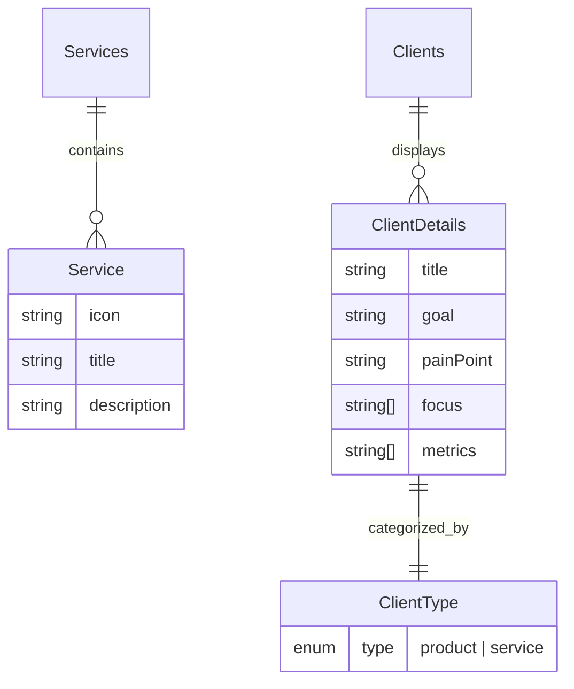
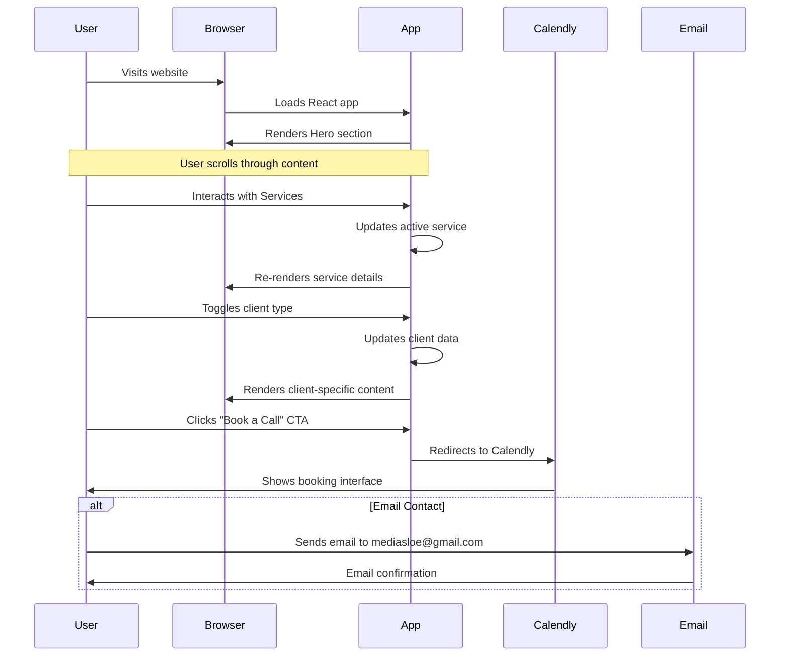
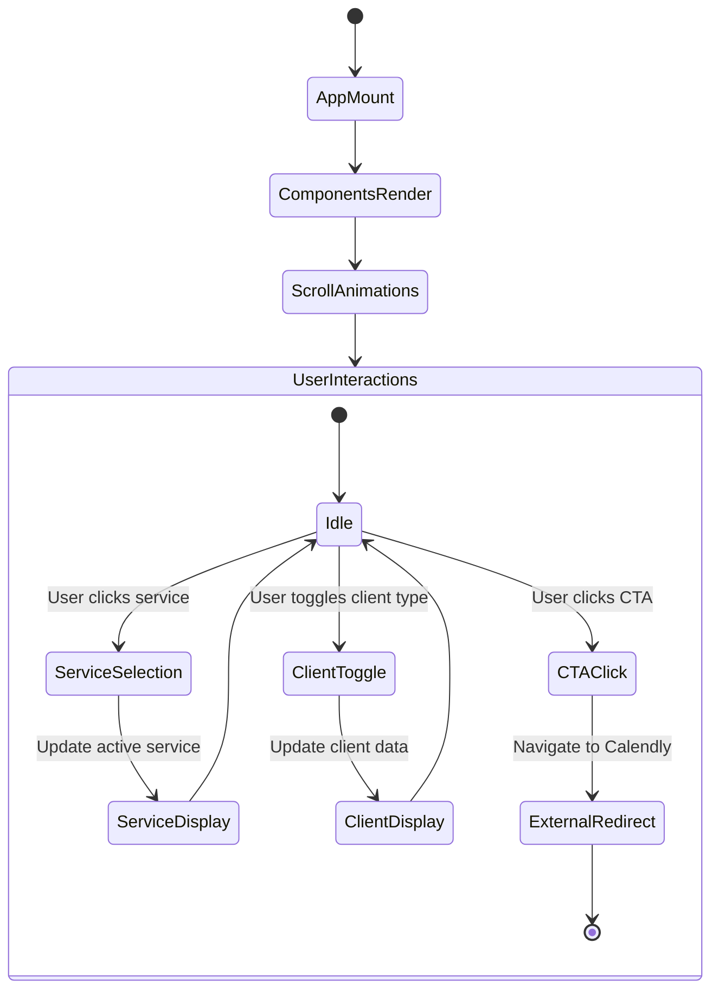
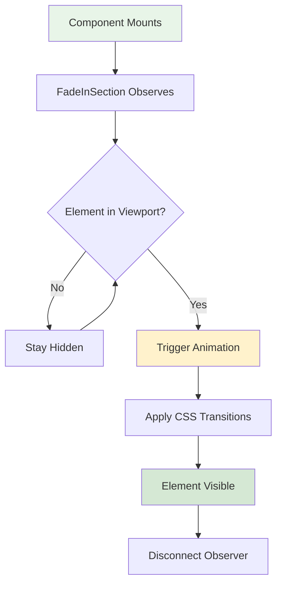
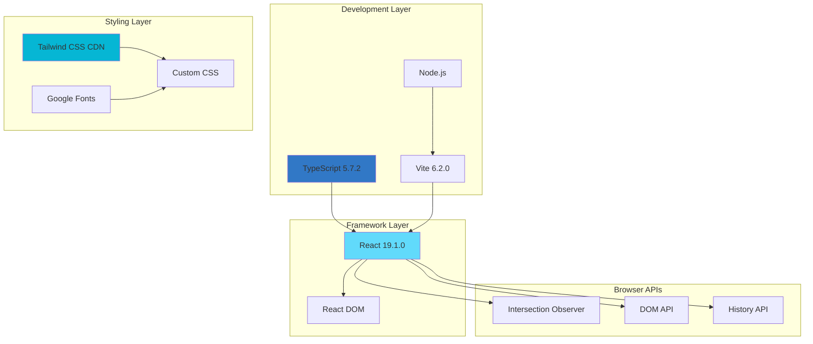
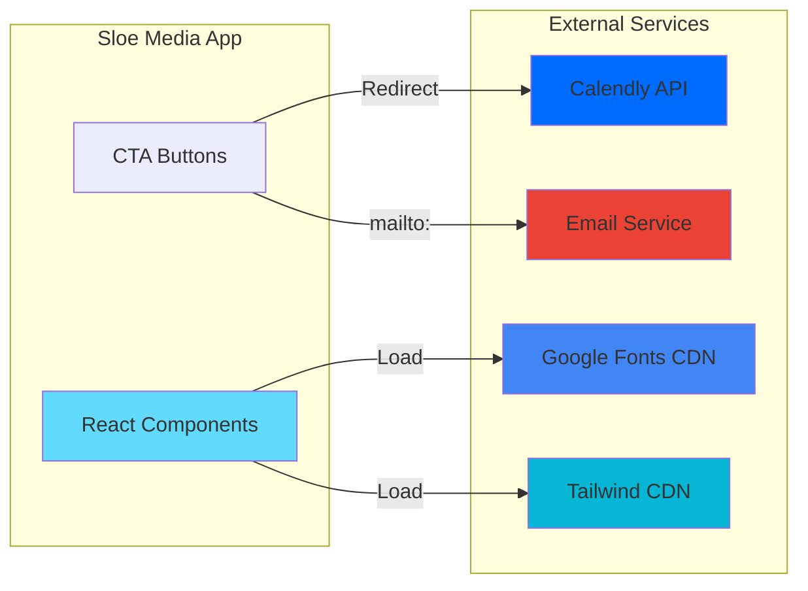
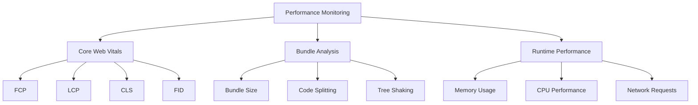
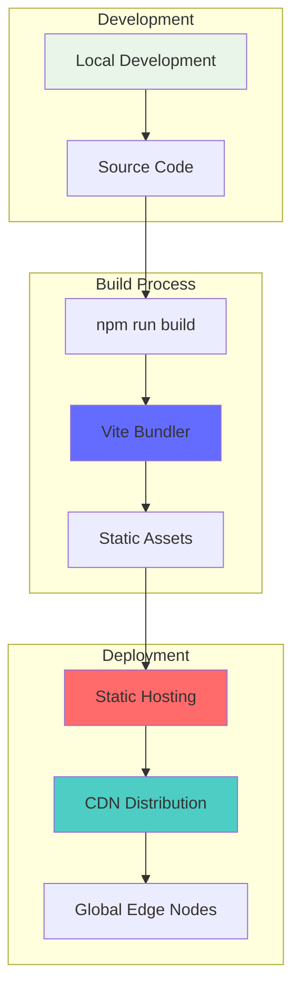

# Sloe Media: AI-Powered Brand Growth - Architectural Document

## Table of Contents
1. [High-Level Application Overview](#high-level-application-overview)
2. [System Architecture](#system-architecture)
3. [Component Architecture](#component-architecture)
4. [Key Data Models](#key-data-models)
5. [Core Workflows](#core-workflows)
6. [Technology Stack](#technology-stack)
7. [External Integrations](#external-integrations)
8. [Security Considerations](#security-considerations)
9. [Performance Considerations](#performance-considerations)
10. [Deployment Strategy](#deployment-strategy)

## High-Level Application Overview

### Purpose
Sloe Media's website is a responsive single-page marketing application designed to showcase the company's AI-powered brand growth services. The platform serves as a lead generation tool for a growth agency that combines strategic creativity with advanced AI to build high-performance growth engines for businesses.

### Business Objectives
- **Lead Generation**: Convert visitors into qualified leads through strategic call-to-action placements
- **Brand Positioning**: Establish Sloe Media as an AI-powered growth operator
- **Service Showcase**: Present the ScaleKit™ offering and differentiate from traditional media buyers
- **Trust Building**: Demonstrate expertise through clear value propositions and process transparency

### Target Audience
- **Primary**: Product-based brands (eCommerce, DTC) seeking to improve ROAS and scale
- **Secondary**: Service-based clients (coaches, creators) looking to automate lead generation

## System Architecture



### Application Type
- **Frontend**: Single Page Application (SPA)
- **Backend**: None (static site)
- **Database**: None (no persistent data storage)
- **Architecture Pattern**: Component-based architecture with React

## Component Architecture



### Component Hierarchy

#### Core Layout Components
- **App**: Root component orchestrating the entire application
- **Header**: Navigation with responsive mobile menu
- **Footer**: Simple copyright and contact information

#### Content Components
- **Hero**: Primary value proposition and main CTA
- **Philosophy**: Brand positioning and AI/Human synergy explanation
- **Services**: Interactive showcase of ScaleKit™ offerings
- **Process**: 5-step operational model visualization
- **Clients**: Segmented bulleted lists for product vs. service-based businesses
- **Advantage**: Key differentiators and competitive advantages
- **CTA**: Lead generation with external calendar booking

#### Utility Components
- **FadeInSection**: Reusable animation wrapper using Intersection Observer API

### Component Responsibilities

| Component | Primary Responsibility | State Management | External Dependencies |
|-----------|----------------------|------------------|---------------------|
| Header | Navigation & branding | Local (mobile menu toggle) | None |
| Hero | Value proposition & primary CTA | Stateless | None |
| Services | Interactive service showcase | Local (active service selection) | Service data model |
| Clients | Segmented client information | Local (client type toggle) | ClientDetails data model |
| Process | Process visualization | Stateless | Static process data |
| CTA | Lead generation | Stateless | Calendly external service |
| FadeInSection | Scroll animations | Local (visibility state) | Intersection Observer API |

## Key Data Models

### Service Interface
```typescript
interface Service {
  icon: string;          // Emoji representation
  title: string;         // Service name
  description: string;   // Detailed service description
}
```

### ClientDetails Interface
```typescript
interface ClientDetails {
  title: string;         // Client segment title
  goal: string;          // Primary business objective
  painPoint: string;     // Problem being solved
  focus: string[];       // Array of focus areas
  metrics: string[];     // Key performance indicators
}
```

### ClientType Type Union
```typescript
type ClientType = 'product' | 'service';
```

### Data Model Relationships



## Core Workflows

### User Journey Flow



### Component Lifecycle Flow



### Animation Workflow



## Technology Stack

### Frontend Framework
- **React 19.1.0**: Component-based UI library
- **TypeScript 5.7.2**: Type-safe JavaScript development
- **JSX**: React component syntax

### Build Tools & Development
- **Vite 6.2.0**: Fast build tool and development server
- **Node.js**: JavaScript runtime environment
- **npm**: Package management

### Styling & UI
- **Tailwind CSS**: Utility-first CSS framework (CDN)
- **Google Fonts (Inter)**: Typography
- **CSS3**: Custom animations and transitions

### Browser APIs
- **Intersection Observer API**: Scroll-based animations
- **DOM API**: Direct DOM manipulation
- **History API**: Single-page navigation

### Development Tools
- **ESM (ES Modules)**: Modern module system
- **Source Maps**: Development debugging
- **Hot Module Replacement**: Development experience

### Technology Stack Diagram



## External Integrations

### Third-Party Services

| Service | Purpose | Integration Type | Data Flow |
|---------|---------|------------------|-----------|
| Calendly | Meeting scheduling | External redirect | Outbound only |
| Email (Gmail) | Direct contact | mailto: protocol | No data exchange |
| Google Fonts | Typography | CDN link | Asset loading |
| Tailwind CSS | Styling framework | CDN script | Asset loading |

### Integration Architecture



### Environment Configuration
- **Gemini API Key**: Configured but not actively used in current implementation
- **Environment Variables**: Loaded through Vite's loadEnv

## Security Considerations

### Current Security Measures
1. **No Sensitive Data Storage**: Stateless application with no persistent data
2. **External Link Security**: `rel="noopener noreferrer"` on external links
3. **Content Security**: No user-generated content or dynamic data injection
4. **HTTPS Enforcement**: Recommended for production deployment

### Security Recommendations
- Implement Content Security Policy (CSP) headers
- Use HTTPS for all external integrations
- Regular dependency updates for security patches
- Input sanitization if forms are added in future

## Performance Considerations

### Current Optimizations
1. **Component Lazy Loading**: FadeInSection implements intersection-based loading
2. **CDN Usage**: External resources loaded from CDNs
3. **Font Optimization**: Preconnect to Google Fonts domains
4. **Bundle Optimization**: Vite's tree-shaking and code splitting

### Performance Metrics
- **First Contentful Paint (FCP)**: Optimized through critical CSS
- **Largest Contentful Paint (LCP)**: Hero section optimization
- **Cumulative Layout Shift (CLS)**: Stable layout with defined dimensions
- **Time to Interactive (TTI)**: Minimal JavaScript execution

### Performance Monitoring Recommendations



## Deployment Strategy

### Static Site Deployment
The application is designed for static site hosting with the following characteristics:

1. **Build Process**: `npm run build` generates optimized static assets
2. **Deployment Targets**: Any static hosting service (Netlify, Vercel, AWS S3, etc.)
3. **Asset Distribution**: CDN distribution for global performance
4. **Environment Configuration**: Build-time environment variable injection

### Deployment Architecture



### Recommended Deployment Pipeline
1. **Source Control**: Git repository with main branch
2. **Continuous Integration**: Automated builds on push
3. **Testing**: Component testing and build verification
4. **Deployment**: Automatic deployment to staging/production
5. **Monitoring**: Performance and error tracking

---

## Conclusion

The Sloe Media website represents a modern, performant single-page application built with React and TypeScript. The architecture emphasizes simplicity, performance, and user experience while maintaining scalability for future enhancements. The component-based design allows for easy maintenance and updates, while the static deployment strategy ensures fast loading times and reliable hosting.

The application successfully serves its primary purpose as a lead generation tool while showcasing the company's technical expertise and AI-powered approach to brand growth.
